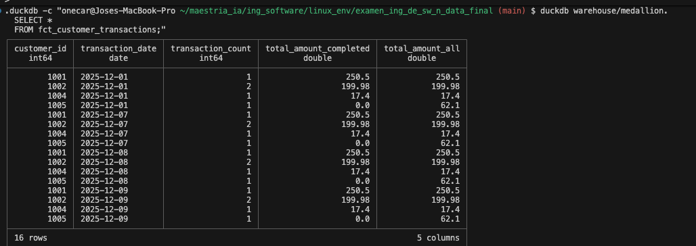
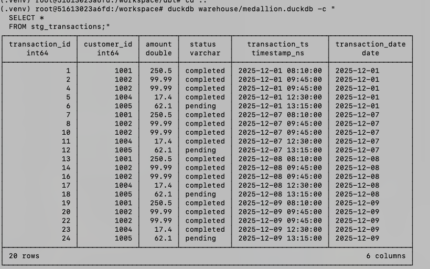
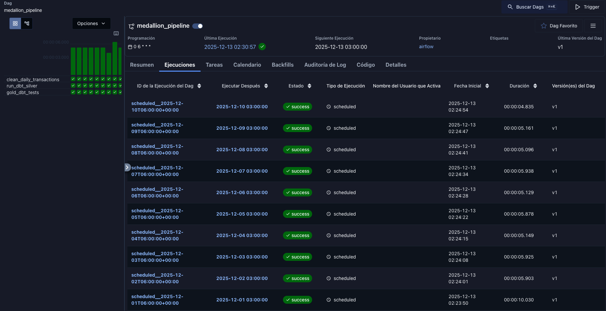

# Se puede correr con docker o manual es indistinto. Se recomienda probar con docker puesto que es mas simple

Nota: el README original, donde están las instrucciones del TP fue modificado ligeramente para que se pueda correr tambien manualmente como sugería el TP

## Ejecución con Docker
Es importante cuando se hace docker compose up esperar a que termine de levantar, si se hace -d no se puede ver con claridad cuando esto pasa y el docker esta hecho para levantar airflow directamente.

```
docker-compose build --no-cache
docker-compose up 
```

Una vez que termino de levantar ir a http://localhost:8080 e iniciar el dag porque aparece deshabilitado. Este comenzara a cargar todos los archivos que hay en raw. Si hay algún problema de login probar en modo incógnito y/o borrar cookies porque airflow deja cookies y sessiones que complican el login.

En caso de querer ingresar a la consola usar 
``` 
docker-compose exec linux-env bash
```
notar que linux-env es el nombre del servicio que pusimos en el docker-compose

Para bajar docker usar: 
```
docker-compose down
```

- Obs 1: Todos los comandos de docker fueron probados en mac y usando la version de docker compose (sin el -) pero no deberia presentar problema alguno usar docker-compose en su lugar.
- Obs 2: se debe usar dbt desde DENTRO del docker compose si se quiere inspeccionar la base de datos de warehouse, para ello el docker instala dbt (en teoria) para ambas plataformas mac arm y linux x86_64, no fue probado en linux.

### Scripts utiles
- var_entorno.sh: setea todas las variables de una. 
- clean_run.sh: borra todas las carpetas accesorias para tener una corrida limpia, es equivalente a clonar el repo de nuevo pero no borra el entorno virtual


### Bugs del entorno y el código entregado que fueron corregidos
- En mac hay que setear OBJC_DISABLE_INITIALIZE_FORK_SAFETY=YES como variable porque airflow lo usa los subprocesos que no son "fork safe", una característica de mac de seguridad que se puede deshabilitar. 
Al usar subprocesos para llamar a dbt se importan librerias nativas de duckdb, dbt compiladas con Objetive-C que no son fork-safe. 
- El código parece ser para una version vieja de airflow que no soporta las sugerencias que se hicieron para pasar los argumentos por ndash en una corrida manual, por lo tanto se modifica todo el código.
- En mac para correr el dag hubo que modificar /etc/host agregando la entrada 127.0.0.1   joses-macbook-pro.local
- ds_nodash ya no está disponible en el contexto de Jinja por defecto
Se recomienda usar logical_date que es un objeto datetime que representa la fecha lógica de ejecución
Usamos .strftime('%Y%m%d') para obtener el formato sin guiones (ej: 20251201)
-  No se pudieron usar las recomendaciones porque no son compatibles con las versiones de Airflow usadas en este entorno de evaluación
- Airflow guarda cookies, por lo tanto al iniciar el entorno dependendiendo de que tipo de configuracion se tenga el navegador puede mostrar login incorrecto, probar loguearse de forma incógnita para validar si son las cookies o valores en la session, de ser asi, eliminarlos o trabajar de modo incógnito.

### Mejoras Ralizadas
- Se agregan mas archivos raw para que pueda correr el proceso con mas de un dia scheduleado y no sea necesario correrlo por consola en un día determinado. De esta forma al inicializar el dag cuando levanta airflow el mismo comienza el barrido de los archivos desde el primer dia configurado en el DAG.
- Se implementa que la lectura de los archivos apendee datos porque no se le encuentra sentido a que solo deje la última fecha en el wharehouse asi que se cargan por customer_id+_fecha y se dejan asi en modelo de marts. Se agrupan segun customer_id pero se desagrupan por fecha. Podrian agregarse, pero en este caso se decidió hacerlo de esa forma porque asi se pueden ver por fecha y si se quieren agrupar se puede generar otra query. Esto no va en contra del enunciado original ni tampoco afecta la corrida ni la coomplejidad del codigo que originalmente se pedia, de hecho lo complejiza mas, pero a nuestro entender le da mas sentido al ejercicio.
- Se modifica la forma de carga de stg_transactions para que tome TODOS los archivos y no se quede con el último nada mas al igual que se hace con el modelo de fc_customer_transactions.
- Se soluciona el problema de la falla cuando no hay archivos para la fechagenerando uno vacio
### Mejoras.y bugs a resolver
- Usar postgres u otra base de datos mas robusta en lugar de duckdb
- Mejorar el manejo de fechas para que tome el uso horario correspondiente (si se corre 3 horas  antes de la medianoche se ve el problema con claridad)
- Cuando los raw estan con el mismo id el proceso rompe. Se podria validar tal caso.
- A veces los procesos se quedan "colgados" si se les da reniciar avanzan, es un bug conocido pero habria que solucionarlo, solo aparece en mac, corriendo en el entorno dockerizado no se reprodujo.


### Corridas
- Se verifica idempotencia
- El dag arranca apagado hay que prenderlo y comienza a levantar todos los archivos
- se puede correr una fecha manualemente con el comando de abajo
```airflow dags trigger medallion_pipeline --run-id manual_$(date +%s) ```

Para el comando 
```duckdb warehouse/medallion.duckdb -c "
  SELECT *
  FROM fct_customer_transactions;"
```

con los datos que existen se encuenta el siguiente resultado


y para las transacciones: 



### Ejecucion completa
